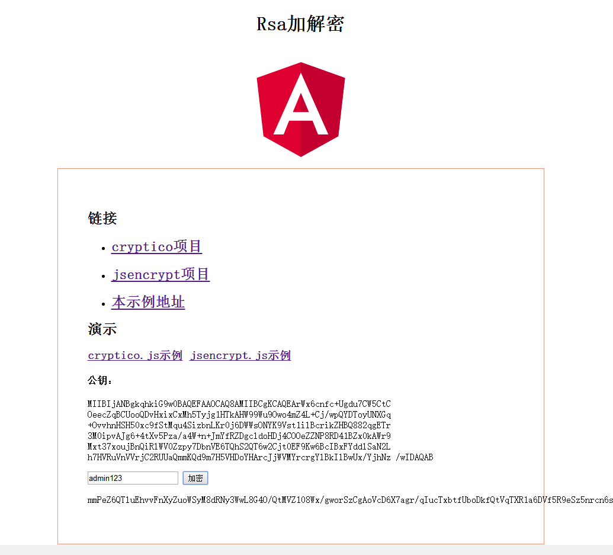
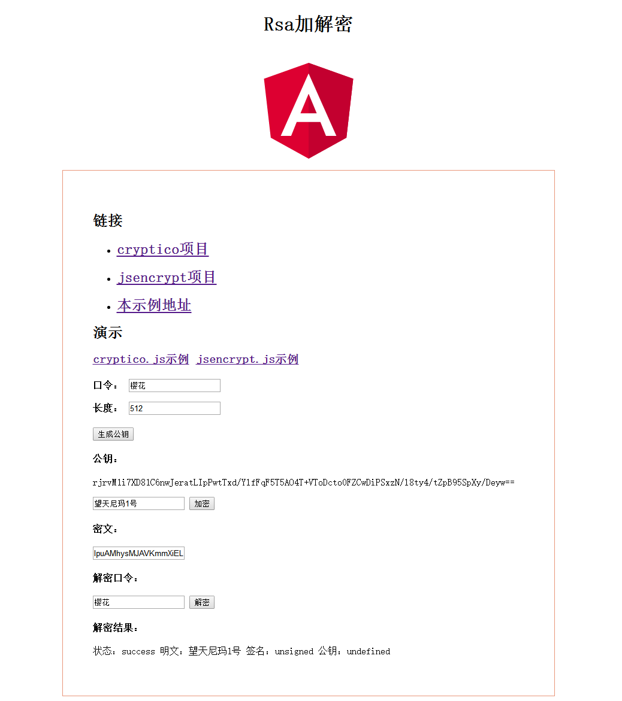

# RsaAngular

项目由 [Angular CLI](https://github.com/angular/angular-cli) version 1.1.2.初始化

## Development server

执行 `ng serve` 命令， 导航到 `http://localhost:4200/`。 文件修改后，会自动加载。

## 构建

执行 `ng build` 以构建项目。生产环境中，使用 `-prod` （混淆）。

## 说明

> 通过.d.ts桥接文件，在TypeScript环境中调用原生的js库，完成 `RSA` 的加密与解密。

**示例使用到的js库**

`base64_utility.js` ：https://github.com/ShashiBadhuk/base64_utility 

`cryptico.js` ：https://github.com/wwwtyro/cryptico

`jsencrypt.js` ：https://github.com/travist/jsencrypt

Angular4 使用TypeScript进行编码，以下是如何在Angular中调用原生js的方法：

- 下载 `RSA` 加解密相关的 `js` 库(cryptico.js，jsencrypt.js)到项目中 
- 在项目的 `.angular-cli.json` 中，打开app节点下的script，配置js库
- 为js库编写 `.d.ts` 声明文件

## 预览

